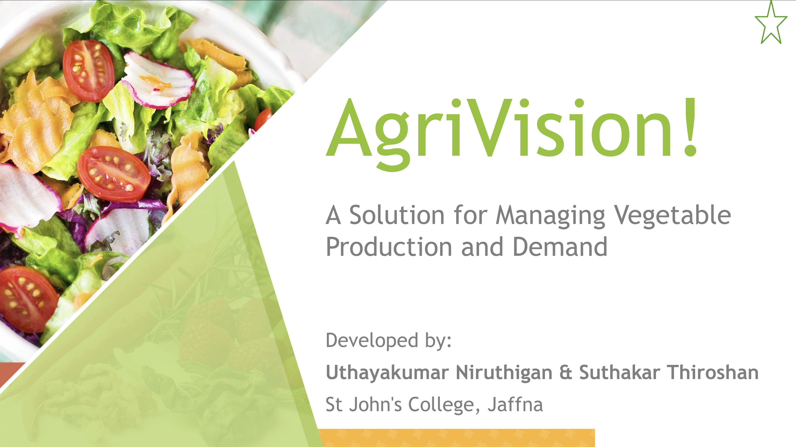
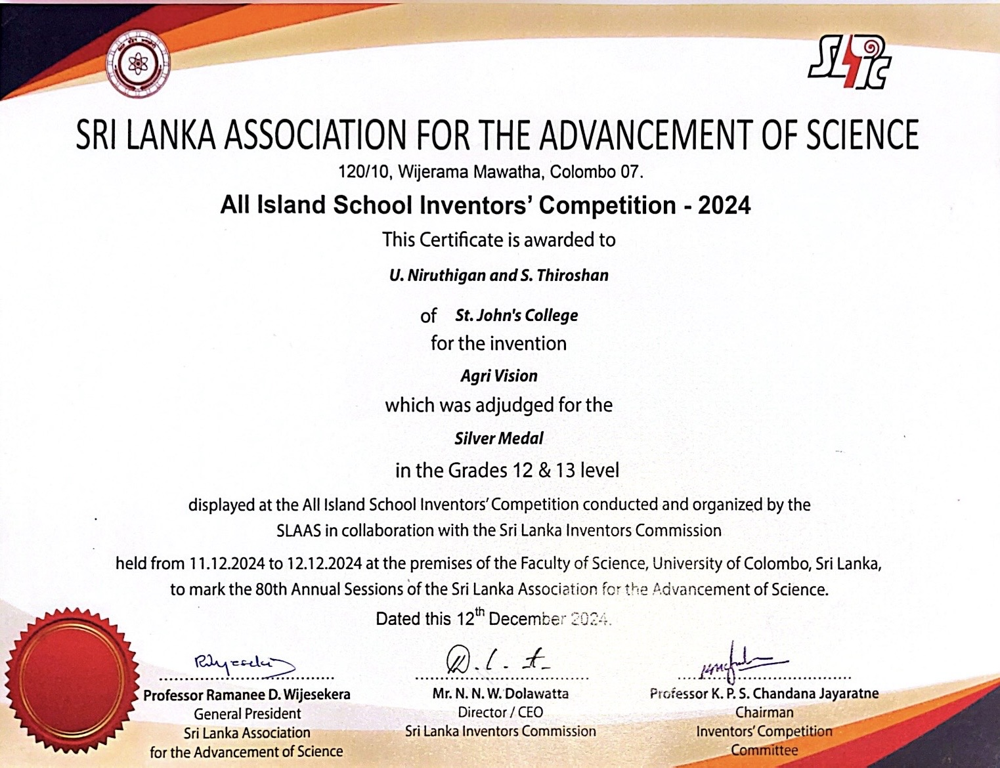

# Agri Vision

**Agri Vision** is an innovative platform designed to bridge the gap between farmers, market demands, and agricultural policymakers. Developed to address the critical issues of overproduction and underproduction, this system provides real-time insights to help farmers align their cultivation with actual market needs, ensuring profitability and sustainability.

---

## Achievement
We are proud to share that **Agri Vision** was awarded the **Silver Medal** at the **All Island School Inventors' Competition 2024** for the Grades 12 & 13 level. The competition was organized by the Sri Lanka Association for the Advancement of Science (SLAAS) in collaboration with the Sri Lanka Inventors Commission.

---

## Problem Statement
The current agricultural landscape faces several systemic challenges:
* **Lack of Data**: Farmers often lack real-time demand data.
* **Supply Mismatch**: Overproduction leads to wastage, while underproduction causes shortages.
* **Profitability Risks**: It is difficult for farmers to decide which crops to cultivate for maximum profitability.

---

## Features
* **Demand Identification**: Assists farmers in identifying crops with higher demand.
* **Data Management**: Simplifies crop data entry and updates.
* **Actionable Insights**: Provides useful tips and details about crops to help farmers make better decisions.
* **Policy Support**: Enables data collection for agricultural policy-making.

---

## The Demand Model
Agri Vision utilizes a specific formula to calculate market demand, allowing for precise analysis:

$$Demand \% = \frac{Total Consumption - Total Production by all Farmers}{Total Consumption} \times 100\%$$

---

## Technical Stack
* **Frontend**: Built with **Flutter** for cross-platform compatibility.
* **Backend**: Managed using **Python** for server-side logic and API handling.
* **Database**: **SQL Server** for secure and efficient data storage.

---

## Benefits
### For Farmers
* Informed crop selection for higher profits.
* Minimized wastage and risk of overproduction.
* Easy record-keeping and demand tracking.

### For the People
* Stable vegetable availability in markets.
* Controlled pricing due to balanced supply and demand.

### For the Agriculture Department
* Centralized data for better policy-making and guidance.
* Enhanced support for farmers based on trends.

---

## Future Roadmap
* **Weather Integration**: Weather data for crop-specific advice.
* **Price Forecasting**: Market pricing forecasts for informed decision-making.
* **Accessibility**: Multi-language support.
* **Alerts**: Mobile notifications for high-demand crop alerts.

---

## Resources
* [Download Presentation (AgriVision.pptx)](other/AgriVision.pptx)

## Authors
* **Uthayakumar Niruthigan** - St John's College, Jaffna
* **Suthakar Thiroshan** - St John's College, Jaffna
